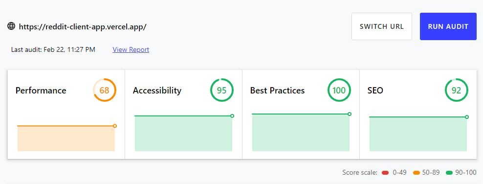

# Reddit Client App


# Description

A front-end web app displaying data fetched from Reddit API. The web app is designed using React and Redux. The goal is to redesign the Reddit website to fit my preference; which are clean and minimalist with a matte black tone.

# Table of Contents

* [Description](#description)
* [Technologies](#technologies)
* [Lighthouse Score](#lighthouse-score)
* [Setup Process](#setup-process)
* [Acknowledgments](#acknowledgements)
* [Ongoing / Future Works](#ongoing-/-future-works)
* [Others](#others)

# Technologies

## Languages

* Javascript
* JSX
* HTML
* CSS

## Framework / Libraries 

* React
* Redux
* Material UI
* AbortController

## Deploy Technology

* Vercel

## Other Technologies

* VSCode
* Git
* GitHub

## Files structure

folder structure for the main files with some brief explanations.

```python
> App.js
> App.css
> index.js
> src /
    > app /
        > reddit.js         # file for Reddit Api fetch call
        > scrollToTop.js    # scroll to top when navigate to page feature
        > store.js          # redux store
    
    > features /
            > AllSubredditsPage /       # page to show all the subreddits -> href=/subreddits
                    > AllSubredditsPage.js
                    > AllSubredditsPage.css
                
            > Header /              
                    > Header.js
                    > Header.css
            > RedditPost /          # box for displaying each post
                    > RedditPost.js
                    > RedditPost.css
                
            > RedditPostList /      # container to display all posts
                        > RedditPostList.js
                        > RedditPostList.css
                        > RedditPostListSlice.js    # reducer logic and action for home posts, and several catagorised posts
                
            > RightSideBar /        # displaying subreddits for programmers on the right side of the page (hardcoded)
                        > RightSideBar.js
                        > RightSideBar.css

            > SearchResults /       # page for displaying search results
                        > SearchResults.js
                        > SearchResults.css

            > SideBar /         # left side bar: navigation and trending subreddits
                        > SideBar.js
                        > SideBar.css

            > SinglePost /      # page for displaying singular posts with its comments, and can click on image
                        > SinglePost.js
                        > SinglePost.css

            > SubredditBox /        # feature in the SideBar to display trending subreddits
                        > SubredditBox.js
                        > SubredditBox.css
                        > SubredditsSlice.js   # reducer logic and action for storing trending subreddits in redux store

            > SubredditPage /       # page to display the selected subreddit
                        > SubredditPage.js
                        > SubredditPage.css
```
# Lighthouse Score



# Setup Process

* Clone or download the repository
* Open the directory on the terminal and run the development by typing 'npm run' (make sure to npm install everything)

# Acknowledgements

This project obtains the data from Reddit API. I have nothing to do with the content displayed in the web app. This is a Codecademy project for Full-Stack Software Engineering Course. The goal was to practice and implement the front-end skills gained during the course (HTML, CSS, JavaScript, React, Redux, Jest, Enzyme and Selenium, Git and Github Projects, Command line, Wireframes)

# Ongoing / Future Works

## Ongoing works

* Testing suite using Jest, Enzyme and Selenium
* Circular loading icon feature when loading the page

## Future works

* Adding the user page

## Others

* if you guys interested in contributing to this web app (fixing bugs or adding new feature), open a pull request